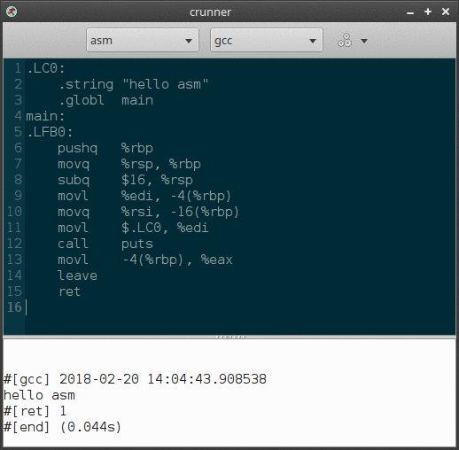

# crunner - a code sketching tool

**crunner** is a simple GUI-based tool for running code and viewing its output. It differs from traditional code editors in that the file does not need to be saved before running. This makes it ideal for tweaking single-file sketches.

<p align="center"> 

</p>

## Overview

* Run code without saving or opening another terminal.
* Can be configured for almost any language, compiled or interpreted.
* Ideal for compilers/interpreters that support stdin.
* If you are confused as to why this is even a thing, see rationale section below.

## Dependencies

crunner is written in `python3` and depends on Gtk3, GtkSourceView, and GObject Introspection. You will need to ensure the proper gir files are installed. On Ubuntu, the  package `gir1.2-gtksource-3.0` will be sufficient to pull all the Gtk-related dependencies.

## Configuration

crunner can be configured via the per-user configuration file `~/.crunner.json`. Take a look at `example.crunner.json` for several example language configurations.

Note: a default configuration will be copied to `~/.crunner.json` if it does not exist.

### Languages

To add a new language configuration, edit `~/.crunner.json`. Under languages, add a new property for the language:

```json
	"asm":{
		"mime": "text/x-asm",
		"syntax": "asm",
		"action": "gcc",
		"actions": {
			"gcc":[["gcc", "-xassembler", "-o", ".runner", "-"],["./.runner"]]
		},
		"clean": ".runner"
	}
```

* `mime` - Optional. A mime type description for the file type. Currently unused by the application.
* `syntax` - Optional syntax highlighting identifier. See `/usr/share/gtksourceview-3.0/language-specs` for installed specs, the proper id is in the `<language>` tag in each file.
* `action` - Required. The default action to take for this language. Must match one of the `actions`.
* `actions` - Required. Possible actions for this language. See below section for more details.
* `clean` - Optional. If present, crunner will check for this file and remove it after execution. Useful for cleaning up executable created by a compiler.

#### Actions

Actions are described by an object with properties for each action. The value of this property is a list of commands. Each command is an array of arguments. The first command always receives the text buffer via standard input. Subsequent commands receive no input.

The way crunner executes multiple commands is similar to a shell. Commands are executed sequentially, but only if the previous exit code is zero. So the above "asm" example is equivalent to the shell expression:

`gcc -xassembler -o .runner - && ./.runner`

If the first step fails to assemble and link the code, no attempt is made to run the output.

Since there is a `clean` property, `.runner` is removed after execution regardless of exit code.

### Editor

The editor section of the config is used to configure the GtkSourceView and other crunner settings.

* `font` - A font description for the editor and output area.
* `style` - The GtkSourceView color scheme. See `/usr/share/gtksourceview-3.0/styles` for a list of isntalled styles.
* `language` - The default language mode to select when crunner is started.
* `styles` - This doesn't do anything, it is simply a reference for the default GtkSourceView color styles.

## Rationale

crunner is for very quickly testing or writing small bits of code. It may seem redundant to have a tool for this in a world where every other programming language has a REPL and any text editor can be configured to execute the current file. Consider the following:

* You want to test and rapidly tweak functions in isolation, but it is inconvenient or impossible to do so in a REPL.
* You have no reason to save the code, you just need to quickly see how the language behaves for some code and then discard it.
* You don't want to juggle with source files, compiling, executable bits, configuring your main editor, cleanup, or anything that takes your mind off the problem. The answer is all that matters, and you need it fast.

crunner shines for this type of case. Well, so long as its been configured with the language you are using before you need it!

With this rationale in mind, crunner has many practical uses that *supplement* a more traditional development workflow. It can also come in handy when learning a new language. However, it is obviously not suitable for many use-cases:

* It is not a replacement for your text editor or IDE.
* It is not intended for multi-file programs.
* It is not practical to use with programs that rely on command line arguments.
* It is not usable for programs that rely on standard input (these will probably cause crunner to hang).
* It won't work with languages like Java that rely on the source file matching the name of the class.
* It is not good for some programs with dependencies, for instance a c program that must be linked to a specific library.

You could probably work around these with enough diligence, but at that point you might as well just save the file and run it traditionally :)

